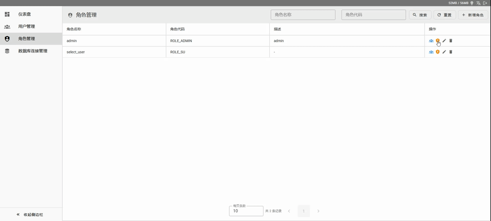
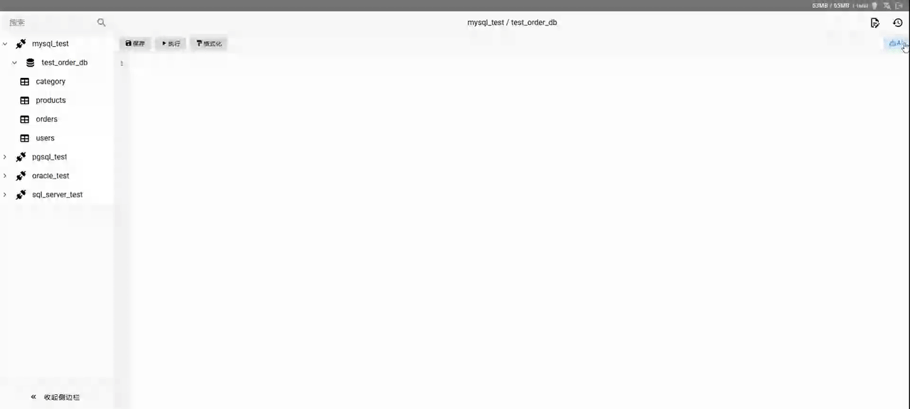
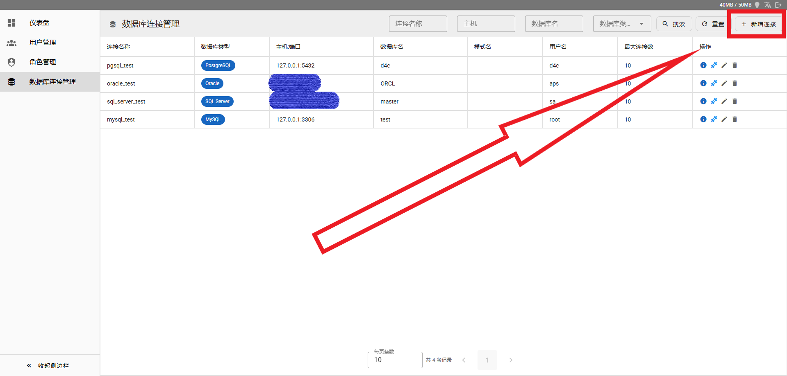
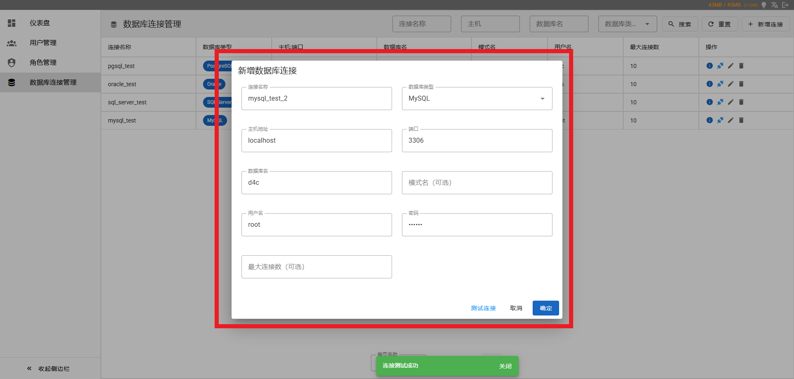
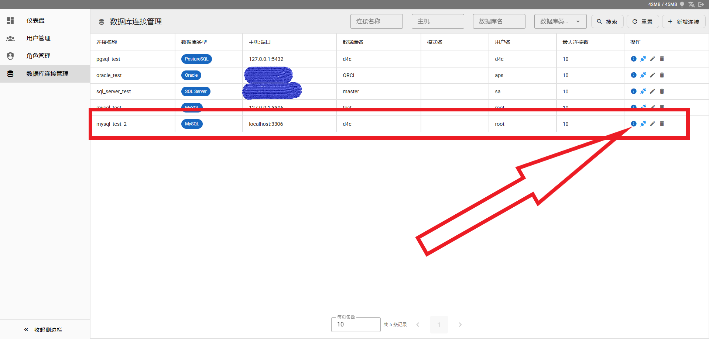
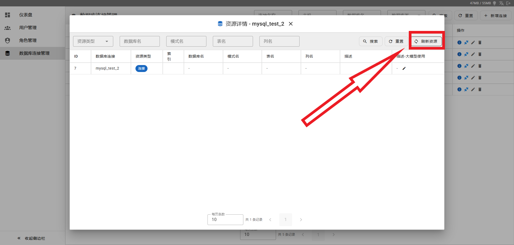
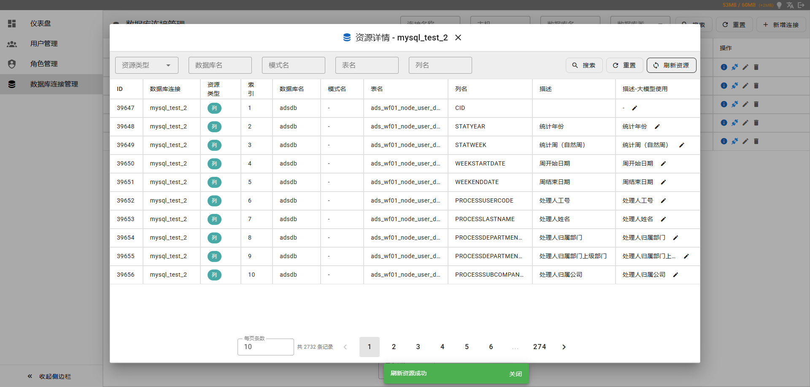
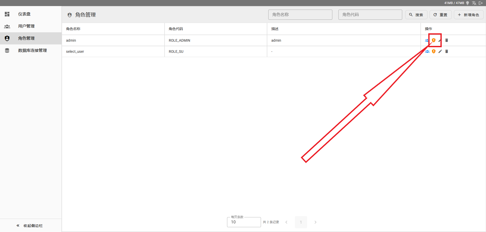
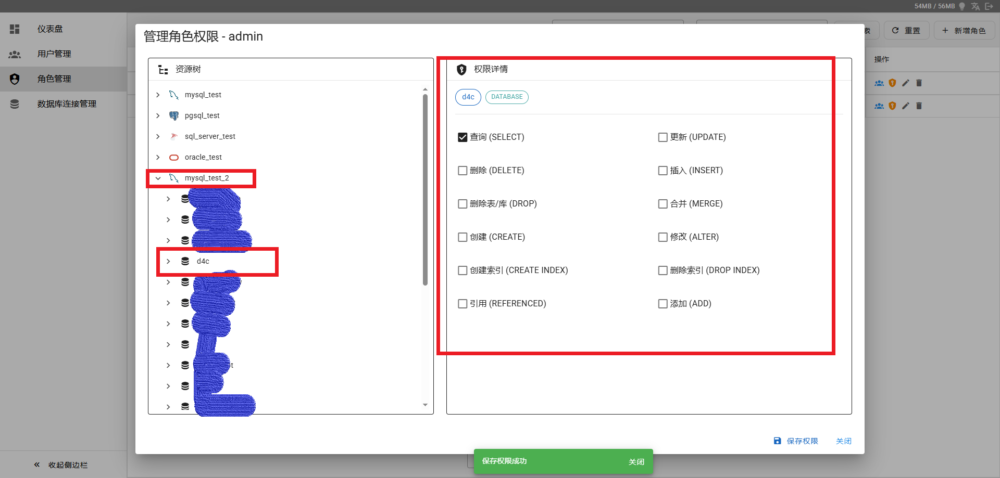
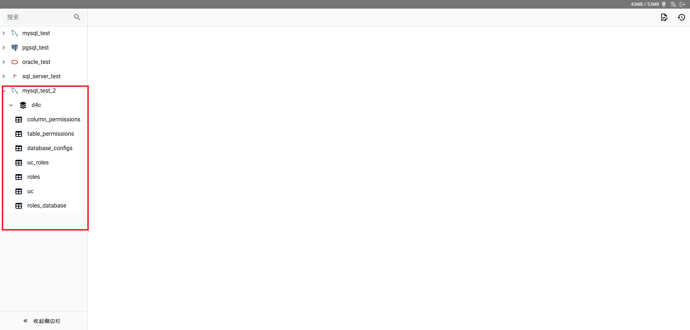

# D4C

`d4c` 是 **D4C** 的 Java 后端服务，并内置前端静态资源，构成面向运维与开发团队的 Web 数据库可视化工具。

定位类似 DBeaver、Navicat、pgAdmin 的网页版替代方案，核心目标是：**不装客户端，也能安全、高效地查询和管理生产数据**。本仓库以 **权限管理、鉴权与策略执行** 为中枢，提供 API、多数据源访问、字段级权限裁剪与 AI SQL 等后端能力。

> **权限管理**是 D4C 的差异化能力：在单一平台内集中配置用户、角色与授权策略，将**数据库 / 表 / 字段**级访问控制与查询结果裁剪贯通到每次 SQL 执行，避免「能连库即见全表」的粗放访问。

## 为什么用 D4C

- 在企业数据库管控严格场景下，开发、运维、测试查库往往需要反复申请权限并经过多层流程，效率低、协作成本高
- **权限在平台侧统一管理**：数据库、表、字段级授权与审计策略可配置，无需在每台目标库上重复维护多套账号与细粒度授权
- 管理员后台一键配置数据库连接，普通用户即开即用
- 浏览器访问，免去本地安装、版本差异和连接配置负担
- 面向真实生产场景，兼顾查询效率与数据安全

## 核心能力

### 1) 权限管理：字段级数据权限管控

权限策略在平台内集中维护，并贯穿登录鉴权、连接授权与 SQL 执行链路，实现「配置即生效」。

- 内置完整权限模型：用户、角色、授权策略
- 支持数据库、表、字段级 CRUD 权限控制
- SQL 查询结果按权限自动裁剪
- 例如执行 `select * from user` 时，仅返回当前用户可读字段

### 2) 多数据库统一访问

当前支持：

- MySQL
- PostgreSQL
- Oracle
- SQL Servcer

后续将持续扩展，计划支持更多关系型及常见分析型数据库，在统一界面下完成连接、查询与管理，降低异构数据库协作成本。

### 3) AI SQL 助手

- SQL 解释：快速理解复杂语句含义
- SQL 优化：辅助发现性能与可维护性问题
- SQL 改写：提升可读性，支持场景化重构
- 自然语言转 SQL：降低 SQL 编写门槛

## 项目架构

- 前端已打包集成进后端静态资源（`src/main/resources/static`）
- 后端服务：`d4c`（Java，当前仓库）

启动本服务后即可直接访问 Web 界面（包括 `/admin` 页面路由）。

## 技术栈

- Java 21
- Spring Boot 3.x
- Spring Security、JWT（jjwt）
- MyBatis-Plus、Druid 连接池
- Spring AI（OpenAI 兼容 Chat）
- 各厂商 JDBC 驱动（见 `pom.xml`）

## 适用场景

- 企业内部需要 **集中式权限管理** 与字段级数据权限治理、满足合规与最小权限要求的场景
- 运维、研发、DBA 在受控权限下在线查询生产数据和故障排查
- 团队希望统一数据库访问入口并减少客户端维护成本
- 希望借助 AI 提升 SQL 生产效率的研发团队


## 截图与演示





## 快速开始

### 环境要求

- JDK 17+
- Apache Maven 3.6+
- 任选其一：**PostgreSQL 14+**（与默认 `application.yml` 一致）或 **MySQL** 等，用于存放 D4C 平台元数据（用户、连接配置、权限等）

### 初始化元数据库

根据所选数据库执行对应脚本（路径均在仓库 `db/` 下）：

- PostgreSQL 14+：参考并执行 `db/pgsql.sql`

创建库、账号后，将连接信息写入 `src/main/resources/application.yml` 中的 `spring.datasource`（或用自己的 `application-local.yml` / 环境变量覆盖，避免改坏默认文件时可复制一份本地配置）。

### 配置说明

主要关注 `src/main/resources/application.yml`：

| 配置项 | 说明 |
|--------|------|
| `server.port` | HTTP 端口，默认 `44444` |
| API 基础路径 | 控制器统一以 `/api/*` 开头（例如 `POST /api/auth/login`）；页面路由在 `/`（例如 `/admin`） |
| `spring.datasource.*` | 平台元数据库（用户、权限、连接配置等） |
| `ai-model.chat.*` | AI 模型：`api-key`、`base-url`、`model` 等，请使用环境隔离的配置，生产环境勿写死密钥 |

### 编译与运行

```bash
mvn clean package -DskipTests
java -jar target/d4c-1.0.0.jar
```

本地开发可直接：

```bash
mvn spring-boot:run
```

### 启动后访问

- 先确保本服务已启动且元数据库已初始化
- 首页/普通页面：`http://<host>:44444/`
- 管理页面（SPA 路由）：`http://<host>:44444/admin`

管理页面受 Spring Security 控制：`/admin/**` 需要 `ADMIN` 角色；登录接口为 `POST /api/auth/login`，后续请求需携带请求头 `Authorization: Bearer <token>`。

## 使用步骤
先进入管理后台：`http://<host>:44444/admin`
1. 添加连接
   
   
   
2. 点击查看资源详情
   
   
3. 刷新资源,同步数据库表数据
   
   
   
   
4. 角色管理页面点击权限管理,给角色添加指定权限
   
   
   
   
   注：给整个库设置权限会同步设置其下层的表、字段权限。以此类推。

回到首页`http://<host>:44444/`刷新即可查看已分配的数据库权限
   
   

## 开源版说明

- 本仓库为 GitHub 开源版，聚焦核心能力持续迭代
- 欢迎通过 Issue / PR 提交问题反馈与改进建议
- 企业级增强能力可基于开源版进行扩展

## 免责声明

本项目为开源项目，持续迭代中，当前功能按“现状（AS IS）”提供。  
如需用于生产环境，请结合自身安全与合规要求完成充分测试、权限校验与数据备份。  
欢迎通过 Issue / PR 反馈问题与改进建议，一起把项目做得更好。

## Roadmap

- 持续扩展更多关系型数据库支持
- 增强 SQL 操作记录与审计能力
- 支持单点登录（SSO）能力，便于企业统一身份认证接入

## 联系方式

- 问题反馈与功能建议：请通过 [Issues](../../issues) 提交
- 邮箱：`lanfaicai@163.com`

## License

本项目采用开源许可证，详见仓库根目录 `LICENSE` 文件。
